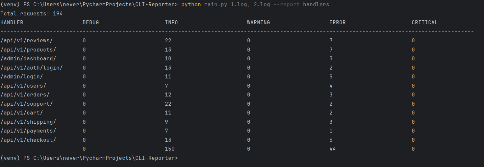
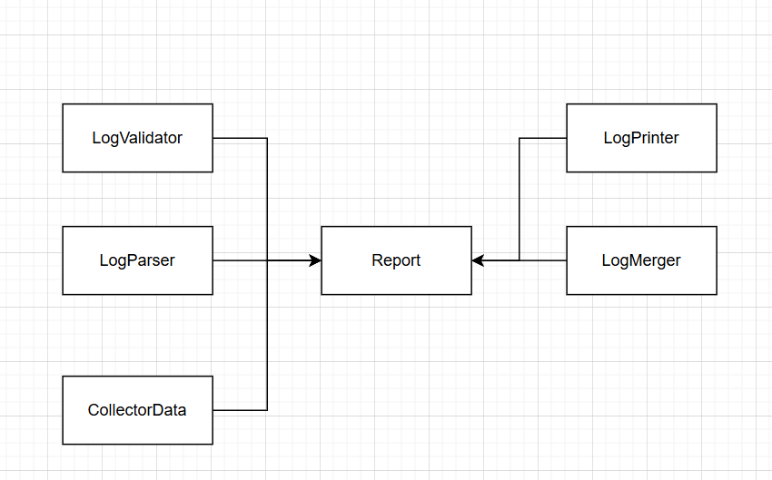

# CLI-Reporter


CLI-приложение для анализа логов Django и формирования отчетов. Поддерживает обработку больших файлов и параллельную обработку.

## 📦 Установка

1. Клонируйте репозиторий:
   ```bash
   git clone https://github.com/your-username/CLI-Reporter.git
   cd CLI-Reporter
   ```
2. Установите зависимости:
    ```bash
   cd requirements
   pip install -r requirements.txt
   ```

## 🚀 Использование
### Синтаксис:

```bash
python3 main.py [ФАЙЛЫ_ЛОГОВ] --report [НАЗВАНИЕ_ОТЧЕТА]
```

### Пример:

```bash
python3 main.py logs/app1.log logs/app2.log --report handlers
```
### Доступные отчеты:

handlers — статистика запросов к API по уровням логирования.

Пример вывода:


## 🛠 Тестирование
```bash
pytest tests/ -v
```
## 🧩 Архитектура
### Основные компоненты:

1. LogValidator — проверяет, относится ли строка к django.request.

2. LogParser — извлекает уровень логирования и эндпоинт из строки.

3. CollectorData — агрегирует данные для отчета.

4. LogMerger — объединяет данные из нескольких файлов.

5. ReportPrinter — форматирует вывод в консоль.

### Добавление новых отчетов:

1. Расширьте ConfigFabric.config_report новым конфигом.

2. Реализуйте компоненты (валидатор, парсер, коллектор) для отчета.


ТГ - [@maximneverov](https://t.me/maximneverov)
